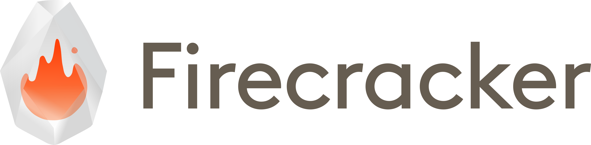

# GPU Passthrough for Firecracker MicroVMs (PCI & VFIO)

**Branch:** `ege/passthrough`  
**Scope:** Add an _opt‑in_ PCI stack, VFIO device passthrough, MSI/MSI‑X support, and Virtio‑over‑PCI transport to Firecracker while preserving microVM principles.

---

## Why this exists

The upstream Firecracker design intentionally avoids PCI to keep the device model minimal, attack surface small, and overhead low. For GPU passthrough, however, **VFIO + PCI** is the industry‑standard mechanism. This fork introduces a small, carefully‑scoped PCI implementation and VFIO integrations that are **off by default** and only built/used when explicitly enabled in config. Virtio devices can continue to use MMIO; PCI is only activated when requested.

---

## High‑level overview of what changed

### New crates (ported & adapted from Cloud Hypervisor)

-   `src/pci/` — Minimal PCI device model:
    -   `bus.rs`: Root, bus, and config‑space routing (IO port config access, optional MMCONFIG).
    -   `configuration.rs`: PCI config space, BARs, capabilities.
    -   `device.rs`: Device trait + BAR programming helpers.
    -   `msi.rs`, `msix.rs`: MSI/MSI‑X capability emulation and interrupt plumbing.
    -   `vfio.rs`: VFIO‑PCI device wrapper: BAR sizing/allocation, DMA map/unmap, INTx/MSI/MSI‑X wiring.
-   `src/vm-device/` — Basic bus/device/interrupt traits used by the PCI stack.
-   `src/vm-system-allocator/` — Address allocators for PCI 32‑bit and 64‑bit MMIO windows and GSI routing.

### VMM integration

-   `vmm/src/builder.rs`:
    -   Creates the **KVM VFIO device** (`KVM_DEV_TYPE_VFIO`) and a **VFIO container**.
    -   Allocates a **PCI segment** with 32‑bit and 64‑bit windows and a **PciConfigIo** device on the PIO bus.
    -   Registers BAR MMIO ranges on the MMIO bus; in‑guest config cycles go through IO ports (CF8/CFC) or, if present, MMCONFIG.
    -   Maps **all guest memory regions** into the VFIO IOMMU container for device DMA.
    -   Wires interrupts: Legacy INTx (optional) and MSI/MSI‑X via the VMM interrupt manager.
    -   Adds **Virtio‑over‑PCI** transport; Virtio‑MMIO remains the default when PCI is disabled.
-   `vmm/src/devices/pci_segment.rs`:
    -   Manages one PCI segment (id 0), bus/device numbering, and routing.
    -   Exposes a `PciConfigIo` object on the PIO bus.
-   `vmm/src/interrupt.rs`:
    -   MSI interrupt manager (irqfd registration, enable/disable, teardown).
-   `vmm/src/acpi/mod.rs` + **new** `acpi-tables/src/mcfg.rs`:
    -   Builds **MCFG** so guests can use PCIe MMCONFIG (in addition to IO‑port config space).
-   `vmm/src/devices/virtio/transport/`:
    -   Split Virtio transport into `mmio.rs` and **new** `pci_device.rs` (+ `pci_common_config.rs`).

---

## Key design choices & rationale

-   **Single segment, bus 0, function 0 only.** Keeps enumeration and routing simple; no bridges or multifunction. (Comments in `builder.rs` reflect this and compute the BDF accordingly.)
-   **VFIO DMA safety.** On boot, we map the _exact guest memory ranges_ into the VFIO container (`dma_map` per region) and unmap on teardown, constraining device DMA to the guest.
-   **MSI/MSI‑X preferred.** MSI and MSI‑X capabilities are emulated/enabled when present; INTx fallback exists but is disabled unless explicitly used.
-   **ACPI MCFG + IO‑port config.** Guest can access config space through either path. MCFG is exposed via ACPI; IO‑port CF8/CFC is always available on x86_64.
-   **Virtio transport split.** Virtio devices can be surfaced as PCI functions (using `virtio_pci` in guest) when PCI is enabled, or stick to MMIO otherwise.

---

## What exactly changed (by commit theme)

-   **Add PCI crate** — `src/pci/` (bus, configuration, device, msi, msix, vfio).
-   **Add vm-device & vm-system-allocator crates** — shared traits, address allocators, GSI helpers.
-   **Virtio transport refactor** — move MMIO to `transport/mmio.rs` and add `transport/pci_device.rs`.
-   **VMM wiring** — new `devices/pci_segment.rs`, interrupt manager, `builder.rs` VFIO path, PCI address windows in arch layout.
-   **ACPI** — add `Mcfg` table and plumb it into `acpi/mod.rs`.
-   **Tooling** — enable PCI kernel config, minimal seccomp additions.

> Many implementations are cleanly adapted from Cloud Hypervisor and crosvm code paths; SPDX and copyright headers are kept where applicable.

---

## How to use (Quick start, x86_64)

### 0) Host prerequisites

1. **Enable IOMMU** (bootloader):
    - For Intel: add `intel_iommu=on iommu=pt` to kernel cmdline.
    - For AMD: add `amd_iommu=on iommu=pt`.
2. **Load VFIO modules**:
    ```bash
    sudo modprobe vfio
    sudo modprobe vfio-pci
    sudo modprobe vfio_iommu_type1
    ```
3. **Bind your GPU to vfio-pci** (example for a GPU with two functions):

    ```bash
    # unbind from host -> bind to vfio-pci
    echo 0000:21:00.0 | sudo tee /sys/bus/pci/devices/0000:21:00.0/driver/unbind &&
    echo 10de 2321 | sudo tee /sys/bus/pci/drivers/vfio-pci/remove_id &&
    echo 10de 2321 | sudo tee /sys/bus/pci/drivers/vfio-pci/new_id
    ```

### 1) Build Firecracker

```bash
git clone https://github.com/gpu-passthrough-tu-munich/firecracker
cd firecracker
cargo build
# binary at: ./build/cargo_target/debug/firecracker
```

### 2) Build a guest kernel with PCI enabled

Use the provided helper which merges `pcie.config`:

```bash
cd resources
./rebuild.sh
# Outputs CI kernels with PCI, MSI, and virtio_pci enabled.
```

Or, you can just have your kernel downloaded anywhere, ensure your kernel has at least:

```
CONFIG_PCI=y
CONFIG_PCI_MMCONFIG=y
CONFIG_PCI_MSI=y
CONFIG_PCIEPORTBUS=y
CONFIG_VIRTIO_PCI=y
CONFIG_VIRTIO_BLK=y
CONFIG_DEVTMPFS=y
CONFIG_DEVTMPFS_MOUNT=y
```

### 3) Create a Firecracker config (example with GPU + its audio function)

`microvm-config.json`:

```json
{
    "pci": {
        "enabled": true,
        "vfio_devices": [
            {
                "path": "/sys/bus/pci/devices/0000:21:00.0/"
            }
        ]
    },
    "boot-source": {
        "kernel_image_path": "./vmlinux",
        "boot_args": "console=ttyS0 reboot=k panic=1 loglevel=8",
        "initrd_path": null
    },
    "drives": [
        {
            "drive_id": "rootfs",
            "partuuid": null,
            "is_root_device": true,
            "cache_type": "Unsafe",
            "is_read_only": false,
            "path_on_host": "ubuntu-24.04.ext4",
            "io_engine": "Sync",
            "rate_limiter": null,
            "socket": null
        }
    ],
    "machine-config": {
        "vcpu_count": 2,
        "mem_size_mib": 4096,
        "smt": false,
        "track_dirty_pages": false,
        "huge_pages": "None"
    },
    "cpu-config": null,
    "balloon": null,
    "network-interfaces": [
        {
            "iface_id": "net1",
            "guest_mac": "06:00:AC:10:00:02",
            "host_dev_name": "tap0"
        }
    ],
    "vsock": null,
    "logger": null,
    "metrics": null,
    "mmds-config": null,
    "entropy": null
}
```

### 4) Launch

```bash
# (Option A) CLI config file
./build/cargo_target/debug/firecracker --config-file ./microvm-config.json --no-api --no-seccomp
```

### 5) Verify inside the guest

```bash
lspci -nn
# For NVIDIA: nvidia-smi (if proprietary driver installed)
# First, make sure your internet connection is working, otherwise: apply ip forwarding / NAT on the host. Then, adjust your proxies on the guest if needed.
apt update
DRIVER_BRANCH=570
SERVER=-server
LINUX_FLAVOUR=generic
apt install -y linux-modules-nvidia-${DRIVER_BRANCH}${SERVER}-${LINUX_FLAVOUR}
apt install -y nvidia-driver-${DRIVER_BRANCH}${SERVER}
apt install -y nvidia-utils-${DRIVER_BRANCH}${SERVER}
apt install -y nvidia-cuda-toolkit nvidia-cuda-samples
```

---

## Security & tenancy considerations

-   **IOMMU required.** The VFIO path assumes a functional host IOMMU; without it, DMA cannot be safely contained.
-   **Seccomp.** The seccomp profile includes only the syscalls needed for this path; do not disable seccomp in production.
-   **IOMMU group isolation.** Only pass through devices whose IOMMU group contains no unrelated functions (standard VFIO guidance).
-   **Snapshot/Restore.** PCI/VFIO state is **not** included in snapshot/restore yet; use cold boot.
-   **Multi‑tenant posture.** Treat guest workloads as potentially malicious; avoid host GPU drivers bound to the same device, and pin VFIO groups to a single microVM.
-   **Oversubscription.** CPU and network I/O oversubscription continue to work as before. **Memory oversubscription is more limited with passthrough** because DMA mappings pin guest memory for the device.

---

## Limitations (current)

-   x86_64 focused; aarch64 has only minimal adjustments.
-   Single PCI segment (id 0), bus 0; **no hotplug**; **no multifunction** devices.
-   PCI‑to‑PCI bridges are not modelled; devices are placed directly on bus 0.
-   Snapshot/restore support for PCI/VFIO is **TODO**.
-   Testing focused on headless workloads; display outputs, power management, or hybrid‑graphics quirks aren’t handled.

---

## File map (major additions/edits)

**New** (Mostly taken from Cloud Hypervisor)

-   `src/pci/` (crate): `lib.rs`, `bus.rs`, `configuration.rs`, `device.rs`, `msi.rs`, `msix.rs`, `vfio.rs`
-   `src/vm-device/` (crate): `bus.rs`, `interrupt/`, `dma_mapping/`, `lib.rs`
-   `src/vm-system-allocator/` (crate): `address.rs`, `system.rs`, `gsi.rs`, `page_size.rs`, `lib.rs`
-   `src/vmm/src/devices/pci_segment.rs`
-   `src/vmm/src/devices/virtio/transport/pci_device.rs`, `pci_common_config.rs`
-   `src/vmm/src/interrupt.rs`
-   `src/acpi-tables/src/mcfg.rs`

**Modified (with the help of Riccardo Mancini, AWS)**

-   `src/vmm/src/builder.rs` — VFIO device creation, DMA maps, PCI segment setup, Virtio‑PCI wiring.
-   `src/vmm/src/acpi/mod.rs` — include **MCFG** in XSDT.
-   `src/vmm/src/arch/x86_64/layout.rs` — add PCIe MMCONFIG layout.
-   `src/vmm/src/devices/virtio/transport/mmio.rs` — moved from `devices/virtio/mmio.rs`.
-   `src/vmm/src/devices/bus.rs` — new variants: `PioPciBus`, `MmioPciBus`, `VfioPciDevice`, `VirtioPciDevice`.
-   `src/vmm/src/vmm_config/pci.rs` — new user‑facing JSON config for PCI/VFIO.
-   `resources/guest_configs/pcie.config` — guest kernel config fragment for PCI/MSI/Virtio‑PCI.
-   `resources/rebuild.sh`, `tools/devtool`, `resources/seccomp/x86_64-unknown-linux-musl.json` — tooling & seccomp updates.

---

References:

-   Cloud Hypervisor
-   Riccardo Mancini, AWS

---

## REST OF FIRECRACKER README FOLLOWS HERE

<picture>
   <source media="(prefers-color-scheme: dark)" srcset="docs/images/fc_logo_full_transparent-bg_white-fg.png">
   <source media="(prefers-color-scheme: light)" srcset="docs/images/fc_logo_full_transparent-bg.png">
   
</picture>

Our mission is to enable secure, multi-tenant, minimal-overhead execution of
container and function workloads.

Read more about the Firecracker Charter [here](CHARTER.md).

## What is Firecracker?

Firecracker is an open source virtualization technology that is purpose-built
for creating and managing secure, multi-tenant container and function-based
services that provide serverless operational models. Firecracker runs workloads
in lightweight virtual machines, called microVMs, which combine the security and
isolation properties provided by hardware virtualization technology with the
speed and flexibility of containers.

## Overview

The main component of Firecracker is a virtual machine monitor (VMM) that uses
the Linux Kernel Virtual Machine (KVM) to create and run microVMs. Firecracker
has a minimalist design. It excludes unnecessary devices and guest-facing
functionality to reduce the memory footprint and attack surface area of each
microVM. This improves security, decreases the startup time, and increases
hardware utilization. Firecracker has also been integrated in container
runtimes, for example
[Kata Containers](https://github.com/kata-containers/kata-containers) and
[Flintlock](https://github.com/liquidmetal-dev/flintlock).

Firecracker was developed at Amazon Web Services to accelerate the speed and
efficiency of services like [AWS Lambda](https://aws.amazon.com/lambda/) and
[AWS Fargate](https://aws.amazon.com/fargate/). Firecracker is open sourced
under [Apache version 2.0](LICENSE).

To read more about Firecracker, check out
[firecracker-microvm.io](https://firecracker-microvm.github.io).

## Getting Started

To get started with Firecracker, download the latest
[release](https://github.com/firecracker-microvm/firecracker/releases) binaries
or build it from source.

You can build Firecracker on any Unix/Linux system that has Docker running (we
use a development container) and `bash` installed, as follows:

```bash
git clone https://github.com/firecracker-microvm/firecracker
cd firecracker
tools/devtool build
toolchain="$(uname -m)-unknown-linux-musl"
```

The Firecracker binary will be placed at
`build/cargo_target/${toolchain}/debug/firecracker`. For more information on
building, testing, and running Firecracker, go to the
[quickstart guide](docs/getting-started.md).

The overall security of Firecracker microVMs, including the ability to meet the
criteria for safe multi-tenant computing, depends on a well configured Linux
host operating system. A configuration that we believe meets this bar is
included in [the production host setup document](docs/prod-host-setup.md).

## Contributing

Firecracker is already running production workloads within AWS, but it's still
Day 1 on the journey guided by our [mission](CHARTER.md). There's a lot more to
build and we welcome all contributions.

To contribute to Firecracker, check out the development setup section in the
[getting started guide](docs/getting-started.md) and then the Firecracker
[contribution guidelines](CONTRIBUTING.md).

## Releases

New Firecracker versions are released via the GitHub repository
[releases](https://github.com/firecracker-microvm/firecracker/releases) page,
typically every two or three months. A history of changes is recorded in our
[changelog](CHANGELOG.md).

The Firecracker release policy is detailed [here](docs/RELEASE_POLICY.md).

## Design

Firecracker's overall architecture is described in
[the design document](docs/design.md).

## Features & Capabilities

Firecracker consists of a single micro Virtual Machine Manager process that
exposes an API endpoint to the host once started. The API is
[specified in OpenAPI format](src/firecracker/swagger/firecracker.yaml). Read
more about it in the [API docs](docs/api_requests).

The **API endpoint** can be used to:

-   Configure the microvm by:
    -   Setting the number of vCPUs (the default is 1).
    -   Setting the memory size (the default is 128 MiB).
    -   Configuring a [CPU template](docs/cpu_templates/cpu-templates.md).
-   Add one or more network interfaces to the microVM.
-   Add one or more read-write or read-only disks to the microVM, each represented
    by a file-backed block device.
-   Trigger a block device re-scan while the guest is running. This enables the
    guest OS to pick up size changes to the block device's backing file.
-   Change the backing file for a block device, before or after the guest boots.
-   Configure rate limiters for virtio devices which can limit the bandwidth,
    operations per second, or both.
-   Configure the logging and metric system.
-   `[BETA]` Configure the data tree of the guest-facing metadata service. The
    service is only available to the guest if this resource is configured.
-   Add a [vsock socket](docs/vsock.md) to the microVM.
-   Add a [entropy device](docs/entropy.md) to the microVM.
-   Start the microVM using a given kernel image, root file system, and boot
    arguments.
-   [x86_64 only] Stop the microVM.

**Built-in Capabilities**:

-   Demand fault paging and CPU oversubscription enabled by default.
-   Advanced, thread-specific seccomp filters for enhanced security.
-   [Jailer](docs/jailer.md) process for starting Firecracker in production
    scenarios; applies a cgroup/namespace isolation barrier and then drops
    privileges.

## Tested platforms

We test all combinations of:

| Instance       | Host OS & Kernel | Guest Rootfs | Guest Kernel |
| :------------- | :--------------- | :----------- | :----------- |
| c5n.metal      | al2 linux_5.10   | ubuntu 24.04 | linux_5.10   |
| m5n.metal      | al2023 linux_6.1 |              | linux_6.1    |
| m6i.metal      |                  |              |              |
| m6a.metal      |                  |              |              |
| m7a.metal-48xl |                  |              |              |
| m6g.metal      |                  |              |              |
| m7g.metal      |                  |              |              |

## Known issues and Limitations

-   The `pl031` RTC device on aarch64 does not support interrupts, so guest
    programs which use an RTC alarm (e.g. `hwclock`) will not work.

## Performance

Firecracker's performance characteristics are listed as part of the
[specification documentation](SPECIFICATION.md). All specifications are a part
of our commitment to supporting container and function workloads in serverless
operational models, and are therefore enforced via continuous integration
testing.

## Policy for Security Disclosures

The security of Firecracker is our top priority. If you suspect you have
uncovered a vulnerability, contact us privately, as outlined in our
[security policy document](SECURITY.md); we will immediately prioritize your
disclosure.

## FAQ & Contact

Frequently asked questions are collected in our [FAQ doc](FAQ.md).

You can get in touch with the Firecracker community in the following ways:

-   Security-related issues, see our [security policy document](SECURITY.md).
-   Chat with us on our
    [Slack workspace](https://join.slack.com/t/firecracker-microvm/shared_invite/zt-2tc0mfxpc-tU~HYAYSzLDl5XGGJU3YIg)
    _Note: most of the maintainers are on a European time zone._
-   Open a GitHub issue in this repository.
-   Email the maintainers at
    [firecracker-maintainers@amazon.com](mailto:firecracker-maintainers@amazon.com).

When communicating within the Firecracker community, please mind our
[code of conduct](CODE_OF_CONDUCT.md).
